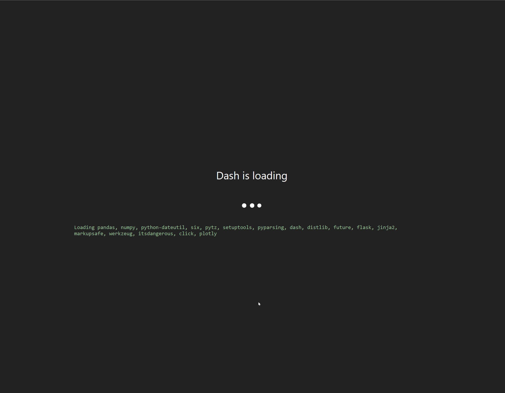

# WebDash

WebDash is a Plotly Dash distribution that **runs entirely in the browser**.

## ⚡ Status ⚡

⚠️ Currently in alpha stage - do not use in production! ⚠️ (Seriously, don't do it 😼)

## 🤔 How does it work? 🤔

The Python scientific stack, including Plotly Dash, Flask and their dependencies, are compiled to WebAssembly via Emscripten and bundled by pyodide. WebDash loads a full Python kernel (version 3.8) and runs it in a dedicated Web Worker. The kernel acts as a virtual Flask web server, serving Dash requests as if it were a normal server. On the front-end, WebDash intercepts any requests intended to go to Dash and routes them to the virtual Flask web server.

This allows the entire distribution to be served as a static website, eliminating the need for containers or virtual environments, thus enabling great scalability.

## 🔥 Try it in your browser 🔥

Demo app available on [Netlify](https://webdash.netlify.app/) and [Vercel](https://webdash-wine.vercel.app/).

_**We have seen issues with Vercel being slow to load pyodide dependencies on Chrome. If that's the case for you, please consider using FireFox to try the demo (we are working with Vercel on this) or try the Netlify deployment link instead**_

## 💣 (Very) Important stuff to be aware of 💣

- This is a really, really experimental idea. It is highly likely your application won't work without some modifications, and very likely it won't work at all.
- Only `dash`, `dash-core-components` and `dash-html-components` have been compiled to WebAssembly. `dash-daq` is not yet available. Therefore, if your application is relying on `dash-daq` or any packages outside the three mentioned above - your app won't work. Please open an issue if there's a package you'd like to add or, even better - open a PR 😻.
- A very limited subset of the Dash API has been tested and/or implemented. This means that debugging is not available, and potentially many other features in the Dash API such as `location` etc. When you find a feature which does not work, please open an issue with a self-contained, sample app we can use to reproduce the issue.
- Native Python-based network requests are not available inside the web-based Python kernel. This is a WebAssembly architecture limitation. This means that the Python `requests` module, although available, won't work (nor will other modules that rely on it). The good news is that you can still retrieve data using the JavaScript `fetch` API, and pyodide ships with a wrapper `pyodide.open_url()` which makes this easy to use from Python. See the `cross_filter_app.ts` file under `src/dash_apps` for an example of how to use this.

## 🎈 Running your own app 🎈

- The app should be saved in the `src/dash_apps` directory as a TypeScript file. The file should contain a JavaScript variable with the app as a string of Python code (we will improve this process in future releases).
- WebDash will look for a global `window.dashApp` variable before running the boot sequence. Your app file should set that variable - look at the `cross_filter_app.ts` file for an example of how to set this.
- Make sure to reference your file in the `index.html` file under the `src` directory so it gets loaded.

## 💚 Contributing 💚

See the [contributing guide](https://github.com/ibdafna/webdash/blob/main/CONTRIBUTING.md) for information about the project's structure and setting up a development environment.

## Disclaimer

> WebDash started as a research project Itay Dafna (@ibdafna) worked on at Bloomberg LP, with help from Paul Ivanov (@ivanov) who provided technical mentorship, guidance and some laughs. All rights are reserved to Bloomberg LP.

Much of this README is based on repos [@jtpio](https://github.com/jtpio/) owns.
